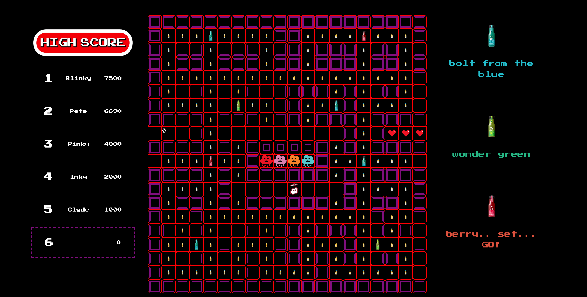
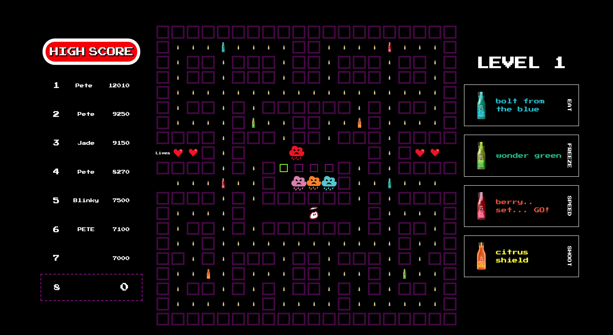
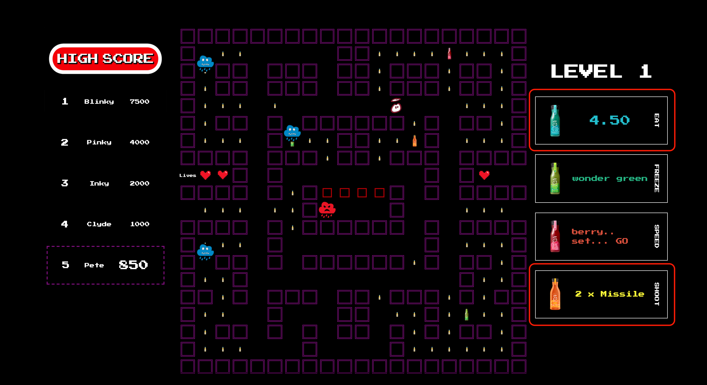
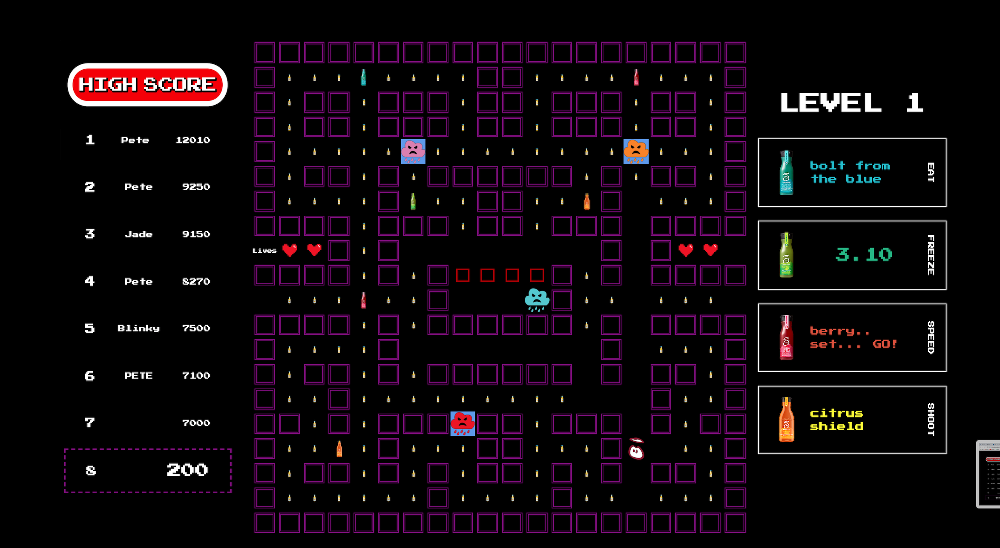
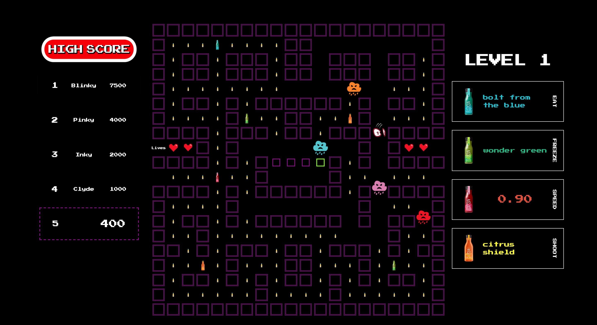
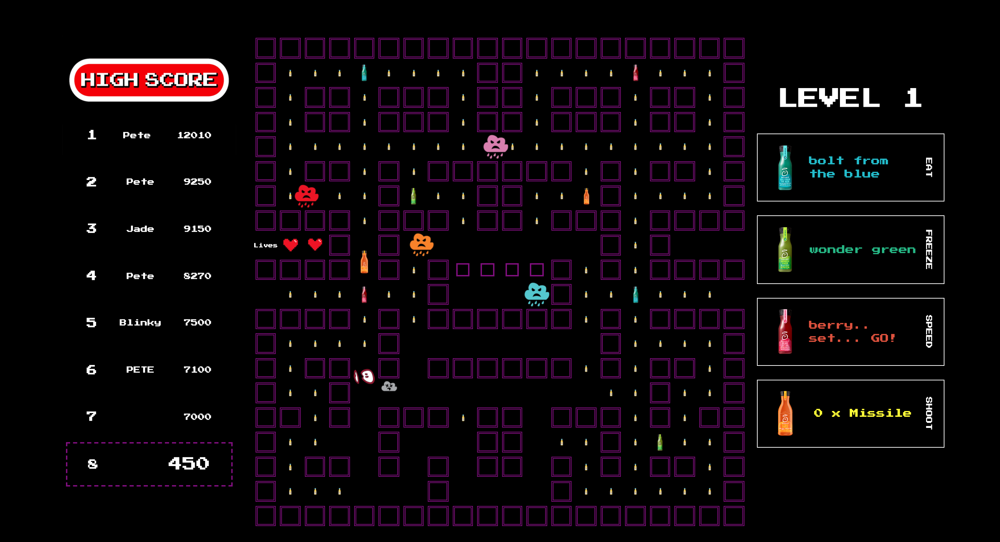
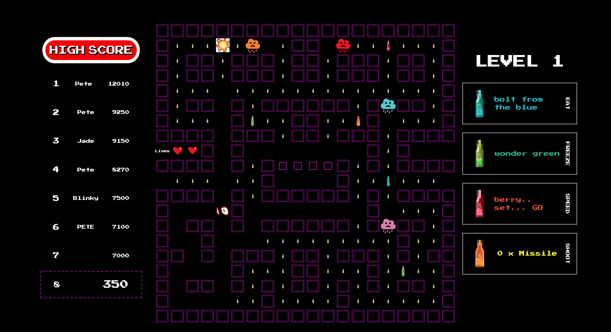

# PAC-DUDE

## Overview

PAC-DUDE is my first front-end development project, produced as part of General Assembly's Immersive Software Engineering Bootcamp.

My task was to create a grid-based game rendered in the browser that utilised 'vanilla' JavaScript, HTML and CSS.

Given a selection of classic arcade games to choose from, I chose to build my take on PAC-MAN. The theme was inspired by last project for my current employer, which was to produce the new 'innocent +' range of drinks.

The project was mainly to consolidate my beginners' knowledge of JavaScript and interacting with the DOM, but it was very important to make the game workable and to achieve the correct level of difficulty to make it challenging, but not impossible for the player to complete all 5 levels.

You can play the game [here](https://peteg-cmd.github.io/project-1/)

## The Brief

* Render a game in the browser
* Design logic for winning & visually display which player won
* Include separate HTML / CSS / JavaScript files
* Stick with KISS (Keep It Simple Stupid) and DRY (Don't Repeat Yourself) principles
* Use Javascript for DOM manipulation
* Deploy your game online, where the rest of the world can access it
* Use semantic markup for HTML and CSS (adhere to best practices)

## The Technologies used

* HTML5
* CSS3
* JavaScript (ES6)
* Git and GitHub
* Google Fonts
* Adobe Illustrator 

## The Approach

The game is built using a grid. A 20 x 20 square is created using JavaScript. HTML divs are created using a for loop and appended as children of the grid. The different classes of cells are added and all cells pushed to an array.

    for (let i = 0; i < gridCellCount; i++) {
      const cell = document.createElement('div')
      cell.classList.add('cell')

      if (i === dude) {
        cell.classList.add('dude-right')
      }

      if (!(noFoodCells.includes(i)) && (!(wallCells.includes(i)))) {
        cell.classList.add('food')
      }

      if (isASuperFoodEatableCell(i)) {
        cell.classList.remove('food')
        cell.classList.add('superFoodEatable')
      }

      if (isASuperFoodFreezeCell(i)) {
        cell.classList.remove('food')
        cell.classList.add('superFoodFreeze')
      }

      if (isASuperFoodSpeedCell(i)) {
        cell.classList.remove('food')
        cell.classList.add('superFoodSpeed')
      }

      if (isASuperFoodMissileCell(i)) {
        cell.classList.remove('food')
        cell.classList.add('superFoodMissile')
      }

      wallCells.filter((element) => {
        if (element === i) {
          cell.classList.add('wall')
        }
      })

      if (penGateCells.includes(i)) {
        cell.classList.remove('wall')
        cell.classList.add('cellGate')
      }

      grid.appendChild(cell)
      cells.push(cell)

    }

A series of functions then control creating and releasing new ghosts in to the game as needed:

    //FUNCTION TO CREATE A NEW GHOST, GIVING IT THE CELL TO START IN IN THE 'GHOST HOLDING PEN'

    function createGhost(startingCell) {

      ghosts.push(new Ghost(`ghost${ghosts.length + 1}`, startingCell))
      cells[startingCell].classList.add(ghosts[ghosts.length - 1].name)
      ghostPenOccupied.push(startingCell)
      
    }

    function flashPenGateGreen(gateNumber) {
      cells[gateNumber].classList.remove('cellGate')
      cells[gateNumber].classList.add('cellGateOpen')
      setTimeout(() => {
        cells[gateNumber].classList.remove('cellGateOpen')
        cells[gateNumber].classList.add('cellGate')
      }, 700)
    }

   
    function releaseGhosts() {
      if (ghostReleaseCountdownActive === false) {
        ghostReleaseCountdownActive = true
        startGhostReleaseTimer()
      }
    }

During gameplay the grid is not visible, but is highlighted for demonstration purposes:

The game start scree the user sees is as below:

## Gameplay

The game is simple and follows the same basic principles of the original PACMAN game, with a few additional functions. In addition to the classic super food that allows the player to chase and eat the ghosts, there are three additional super foods, which are detailed below.

1: 'EAT' - Allows the player to become the hunter, and chase and eat the Ghosts, sending them back to the starting pen if they are caught.

2: 'FREEZE' - Allows the player to freeze the ghosts in their current locations for a set period of time.

3: 'SPEED' - Increases the speed of the player to 1.4x for a set period of time.

4: 'SHOOT' - When this super food is eaten, the player gains two missiles which can be shot straight in any valid direction, and will 'kill' the the Ghosts and send them back to the starting pen if they are hit.

During the first 2 super food periods (Eat and Freeze), ghosts which are in (Or returned to) their starting pen will not be released until the period is over. This is signified to the player through a colour scheme for the 'gates', which are turned red when they are locked.

The amount of time and the amount of missiles the player has for each superfood period are displayed on the right hand side of the screen so the player can easily see the current status of the game, as can be seen (highlighted red) in the screenshot below, showing the 'Eat' superfood period being active.

An example showing each of the other superfood periods active is below.

FREEZE

SPEED

MISSILE

## MOVEMENT OF GAME ELEMENTS

In order to move the experience for the user away from a 'grid based game', and towards more of an arcade experience I used a series of simple animations to ensure the player and the 'ghosts' move smoothly and at the correct interval speed. An example of these animations can be seen below:

	.animate-ghost-left {
	  animation: move-ghost-left 0.35s linear;
	}
	
	@keyframes move-ghost-left {
	  0% {
	    transform: translate(100%, 0);
	  }
	  100% {
	    transform: translate(0);
	  }
	}
	
The only element of the 'superfoods' that also required animations was firing a missile, with the same principle used, but at an increased interval speed of 0.1s.

	.animate-missile-up {
	  animation: move-missile-up 0.1s linear;
	}
	
	@keyframes move-missile-up {
	  0% {
	    transform: translate(0, 100%);
	  }
	  100% {
	    transform: translate(0);
	  }
	}

## SCORING

The player earns 10 points for each bit of food eaten, 50 points for eating a superfood, and 100 points for eating a ghost. 100 points are also awarded if a ghost is hit and killed with a missile.

The scores are kept track of live and the leader board shown and updated on the left side of the screen during gameplay. The scores are persisted using local storage if available.

The player starts the game with 4 lives, and if the game continues to level 3, then an additional life is awarded.

## LEVELS AND DIFFICULTY

Once the player has eaten all the food and superfood the level ends and a message to the player is displayed showing the level and the score. 

There are 5 levels in total. Each level uses the same map, however as levels increase there are 2 changes made to increase difficulty. The first is that the amount of super food is reduced, and randomly selected superfoods are removed. The second is that the intelligence of the ghosts is gradually increased. 

In each subsequent level the ghosts expand their search area by 2 (the amount of cells from themselves they check to locate the player), and once they have found and are tracking the player, with each level their ability to continue tracking the player increases. This starts with them making the correct choices 76% of the time, and increase by 4% with each level completed - meaning in level 5 the ghosts have a 96% chance of tracking the player correctly.

## GHOST MOVEMENT AND INTELLIGENCE

One of the most challenging aspects of creating this game was to get the Ghosts to move in an intelligent way to make the game challenging for the player, and to be able to slowly increase the level of their intelligence to increase the difficulty as the levels increased.

In order to achieve this I wrote a Breadth-first search algorithm that searched for the shortest path to the player at each game interval (0.35s). Initially this algorithm searches 8 cells in every direction, and if the target is not found the ghost moves randomly, but never back on itself. This search radius is increased by 2 cells every time the level increases. In order to give the player a chance to escape the ghosts, there is also an element of chance added in which gives the ghost a certain % chance of making the correct choice every time it runs the search. Initially it will make the correct choice 70% of the time, and this increases by 4% every level, until in level 5 the Ghosts track the player correctly 90% of the times they are given the choice to do so.

To handle all the ghost movement and logic, I created a Ghost class and a Location class, for which the code can be seen below. This is a fairly chunky code snip, however i wanted to show it as this class controls all the logic associated with the ghosts, and enables the game to create and release as many ghosts as needed. 

	 class Location {

      constructor(cellNumber, path) {
        this.cellNumber = cellNumber
        this.path = path
      }
    }

    class Ghost {

      constructor(name, currentCell) {
        this.name = name
        this.ghostClass = name
        this.currentCell = currentCell
        this.directionMoving
        this.availableDirections = []
        this.cellOnPath
        this.cellJustLeft = currentCell

      }
      setAvailableDirections() {

        if ((!(wallCells.includes(this.currentCell + 1))) && this.directionMoving !== 4) {
          this.availableDirections.push(this.currentCell + 1)
        }
        if ((!(wallCells.includes(this.currentCell - 1))) && this.directionMoving !== 2) {
          this.availableDirections.push(this.currentCell - 1)
        }
        if ((!(wallCells.includes(this.currentCell + width))) && this.directionMoving !== 1) {
          this.availableDirections.push(this.currentCell + width)
        }
        if ((!(wallCells.includes(this.currentCell - width))) && this.directionMoving !== 3) {
          this.availableDirections.push(this.currentCell - width)
        }
        return
      }

      moveGhost() {

        // THIS REMOVES THE GHOST FROM EVALUATION IF IT HAS BEEN EATEN

        if (!(eatenGhosts.includes(this.name))) { 

          // THE FOLLOWING 2 X IF ELSE HANDLE IF THE GHOST GOES THROUGH THE TRANSPORT TUNNEL

          if (this.currentCell === 219 && this.directionMoving === 2) {
            this.removeAllGhostClasses()
            this.cellJustLeft = this.currentCell
            this.currentCell -= (width - 1)
            cells[this.currentCell].classList.add(this.ghostClass)

          } else if (this.currentCell === 200 && this.directionMoving === 4) {
            this.removeAllGhostClasses()
            this.cellJustLeft = this.currentCell
            this.currentCell += (width - 1)
            cells[this.currentCell].classList.add(this.ghostClass)

          } else if (!(ghostPenCells.includes(this.currentCell))) {

            // THIS IF STATEMENT CHECKS IF THE GHOST SHOULD MOVE ON THE PATH OR RANDOMLY IF PATH NOT KNOWN. IT ALSO STOPS THE GHOST MOVING ON THE PATH IF THE PLAYER IS THE HUNTER

            if (this.cellOnPath !== '' && this.willFindCellOnPath() === true && playerIsHunter === false) { 

              // THIS IS NEEDED SO THE GHOST DIRECTION IS STILL SET EVEN IF MOVING ON PATH

              this.directionMoving = this.findDirectionMoving(this.currentCell, this.cellOnPath)
              this.removeAllGhostClasses()
              this.cellJustLeft = this.currentCell
              this.currentCell = this.cellOnPath
              this.cellOnPath = ''
              cells[this.currentCell].classList.add(this.ghostClass)
              this.addGhostAnimationClassNeeded()
              this.availableDirections = []

            } else {

              // THIS PICKS THE DIRECTION A GHOST SHOULD GO AT AN INTERSECTION AND IMPLEMENTS IT IF NO TARGET PATH AVAILABLE

              const nextCellGhost = Math.floor((Math.random()) * this.availableDirections.length)

              this.directionMoving = this.findDirectionMoving(this.currentCell, this.availableDirections[parseInt(nextCellGhost)])

              // cells[this.currentCell].classList.remove(this.ghostClass)
              this.removeAllGhostClasses()
              this.cellJustLeft = this.currentCell
              this.currentCell = this.availableDirections[parseInt(nextCellGhost)]
              this.cellOnPath = '' // THIS IS NEEDED AS IF BY CHANCE THE GHOST STOPS FOLLOWING THE PATH, I NEED TO ERASE THE PATH FOR THE GHOST TO FIND AGAIN
              cells[this.currentCell].classList.add(this.ghostClass)
              this.addGhostAnimationClassNeeded()
              this.availableDirections = []
            }
          }
        }
      }

      addGhostAnimationClassNeeded() {
        if (this.directionMoving === 1) {
          cells[this.currentCell].classList.add('animate-ghost-up')
        }
        if (this.directionMoving === 2) {
          cells[this.currentCell].classList.add('animate-ghost-right')
        }
        if (this.directionMoving === 3) {
          cells[this.currentCell].classList.add('animate-ghost-down')
        }
        if (this.directionMoving === 4) {
          cells[this.currentCell].classList.add('animate-ghost-left')
        }
      }

      removeAllGhostClasses() {
        cells[this.currentCell].classList.remove(this.ghostClass)
        cells[this.currentCell].classList.remove('animate-ghost-down')
        cells[this.currentCell].classList.remove('animate-ghost-right')
        cells[this.currentCell].classList.remove('animate-ghost-left')
        cells[this.currentCell].classList.remove('animate-ghost-up')
        cells[this.currentCell].classList.remove('eatableBlue')
        cells[this.currentCell].classList.remove('freezeBlue')

      }

      findDirectionMoving(currentCell, newCell) {
        if (newCell - currentCell === 1 || newCell - currentCell === (width - 38)) { // The additional 'or' sets the direction as moving through the tunnel
          return 2
        }
        if (newCell - currentCell === -1 || newCell - currentCell === (width - 1)) {
          return 4
        }
        if (newCell - currentCell === -(width)) {
          return 1
        }
        if (newCell - currentCell === width) {
          return 3
        }
      }

      // THIS IS TO SET THE % CHANCE THAT, WHEN A TARGET IS AVAILABLE AND A MAP INTERSECTION FOUND, THAT THE CORRECT CHOICE IS MADE. REQUIRED FOR MORE ENJOYABLE GAMEPLAY

      willFindCellOnPath() {
        const num = Math.floor((Math.random() * 100))
        if (num < chanceOfGhostMovingSmartly) {
          return true
        } else {
          return false
        }
      }

      findNextCellOnPath() {
        // PERFORMANCE NOTES - THE SEARCH WIDTH MUST BE CONSTRAINED IN THIS ALGORITHM TO MAINTAIN PERFORMANCE ON A STANDARD LAPTOP/DESKTOP

        if (!(eatenGhosts.includes(this.name))) { // THIS REMOVES THE GHOST FROM EVALUATION IF IT HAS BEEN EATEN

          //CHECK THERE IS A CHOICE TO MAKE (OTHERWISE DO NOT EXECUTE SEARCH)

          if (this.availableDirections.length > 1) {
            const queue = []
            const target = dude

            // START SEARCH

            queue.push(new Location(this.currentCell, [this.currentCell]))
            let pathNotFound = true

            while (pathNotFound) {
              const checkCell = queue.shift()

              // THESE NEXT 2 IFS HANDLE IF THE TARGET (dude) IS WITHIN AN XXX CELL PATH AND HANDLES WEATHER TO SET THE NEXT CELL ON THE GHOST PATH, OR IF TO SET IT TO AN EMPTY STRING

              if (checkCell.path.length > searchWidth - 1) {
                pathNotFound = false
                this.cellOnPath = ''
              }

              //IF THE PLAYER IS FOUND PASS BACK THE NEXT CELL NEEDED FOR EFFECTIVE TRACKING

              if (checkCell.cellNumber === target) {
                pathNotFound = false
                this.cellOnPath = checkCell.path[1]
              }

              // THIS CODE HANDLES FINDING EVERY POSSIBLE PATH UP TO THE LENGTH OF SEARCH SPECIFIED BY THE LEVEL, CHECKING IN EACH POSSIBLE DIRECTION

              directionsCount.map((directionCount) => {

                if (!(wallCells.includes(checkCell.cellNumber + directionCount)) && (!(checkCell.path.includes(checkCell.cellNumber + directionCount))) && (!(checkCell.path.includes(this.cellJustLeft)))) {
                  checkCell.path.push(checkCell.cellNumber + directionCount)
                  const newPath = checkCell.path.slice()
                  queue.push(new Location(checkCell.cellNumber + directionCount, newPath))
                  checkCell.path.pop()
                }
              })
            }
          }
        }
      }
    }

## CHALLENGES

During this project there were 2 main challenges to get the game running as designed.

1: The first was to give the ghosts the correct level of intelligence to make the game challenging, whilst also balancing this with the performance ability of most modern laptops. At first the search width of the ghosts was unrestricted, however the calculation time needed was increasing the interval which controlled the ghost as so many calculations were needed. The trade off here was limit the search width of the ghost to below 15 cells, and if they could not find the player within this width they will move randomly (but will never reverse direction). In the end I was happy with this decision and actually think that it leads to a better game play experience as the ghost do not continually home in on the player and tracking must be triggered by distance.

This issue also drove me to implement another control on triggering the search, which I had not considered originally. The 'ghosts' also run a function before executing the search to check if there is more than one direction available to them. Since they cannot move back on themselves, they only need to execute the search approximately one in every four moves, so adding this simple function reduced the number of searches needed by around 4x, and really helped with the performance issues. This game will now easily run on most computers.

2: The second major challenge was the implementation of multiple 'Super Food Periods' that can overlap and be active concurrently.

The challenge here came from the fact that the game behaves slightly differently depending on which superfood is active, and must handle these together. For the 'Speed' superfood, the player interval speed is also removed from the game interval, and temporarily moved to its own slightly quicker interval speed. To handle these issues I created some global variables to keep track of certain elements, which could be controlled by any of the intervals of superfood functions. This ensured that things like the ghosts being released or returned to the pen if eaten were handled correctly regardless of which or how many superfood periods were active.

An example of the code handling the 'Eat' superfood, and some of the function checks it makes is below:

	 function removeSuperFoodActivateChase(cellNum) {
	// CHECK WHEN A SUPER FOOD IS EATEN
	      if (cells[cellNum].classList.contains('superFoodEatable')) {
	        cells[cellNum].classList.remove('superFoodEatable')
	        playSound('chomp')
	        checkIfEatablePeriodAlreadyActive()
	        clearTimeout(ghostReleaseTimer)
	        ghostReleaseCountdownActive = true //// THIS LINE AND THE LINE ABOVE ENSURE GHOSTS ARE NOT RELEASE UNTIL THE 'EATABLE' PERIOD IS OVER (10 SECONDS)
	        score += 50
	        playerIsHunter = true
	        handleDomDisplayGhostEatabletimer()
	        setGhostsToEatable()
	        startGhostEatableTimeOut()
	      }
	      returnGhostToPenIfEaten()
	    }
	    
	    //CHECK THAT THE A CURRENT EATABLE PERIOS IS NOT ALREADY ACTIVE
	
	    function checkIfEatablePeriodAlreadyActive() {
	      if (((ghosts.some((element) => element.ghostClass === 'eatableBlue')))) { //// THERE IS PROBABLY AN EDGE CASE TO DO WITH THE TIMER HERE THAT NEEDS TO BE SORTED. IF ALL GHOST ARE EATEN DO WE NEED TO HANDLE THE TIMER
	        clearTimeout(ghostEatableTimer)
	      }
	    }
	
	//CHANGE THE GHOST CLASS TO EATABLE IF THEY ARE NOT IN THE HOLDING PEN
	    function setGhostsToEatable() {
	      ghosts.map((element) => {
	        if (!(ghostPenOccupied.includes(element.currentCell))) {
	          cells[element.currentCell].classList.remove(element.name)
	          cells[element.currentCell].classList.add('eatableBlue')
	          element.ghostClass = 'eatableBlue'
	        }
	      })
	    }
	//START THE TIMER AND PAUSE THE GHOST RELEASE TIMER
	    function startGhostEatableTimeOut() {
	      ghostEatableTimer = setTimeout(() => {
	        playerIsHunter = false
	        ghosts.map((element) => {
	          cells[element.currentCell].classList.remove('eatableBlue')
	          element.ghostClass = element.name
	          cells[element.currentCell].classList.add(element.name)
	          ghostReleaseCountdownActive = false
	        })
	      }, timeGhostsRemainEatable * 1000)
	    }
	

## POTENTIAL FUTURE FEATURES

The next step for this project is to create new maps for each level. Originally I had planned to do this but as the deadline for submission loomed I had to de-prioritise this to ensure other functionality was working properly. I do think it would be a better experience for the user though to have at least one or two other maps to play.

Another feature that I would like to implement would be to have the ghosts actively avoid the player during the 'eat' superfood period. Currently they only stop tracking the player, but i think it would be more interesting if they smartly avoided the player.

## LESSONS LEARNED

Naming. This was a hard lesson learnt, and as I moved through the game my name conventions and practices did improve, however I did run in to challenges at times from giving functions or elements names that were not specific enough, or that were too close to other names.

Design mobile first. This game does not work on mobile, and I wish I had given more consideration to this at the start. If i have time in future I may go back and adapt it, but this would have been easier if i had planned for it properly.

